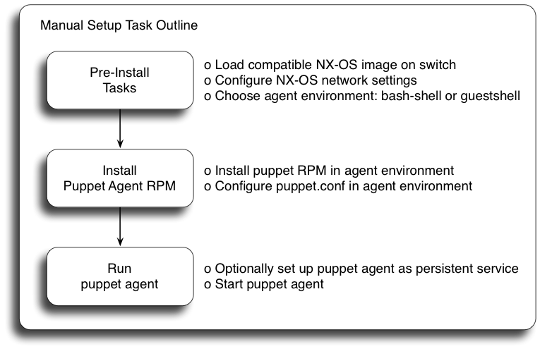

# Puppet Agent Installation & Setup: Cisco Nexus

----
### _EARLY FIELD TRIAL:_ This is a puppet agent EFT for use with Cisco NX-OS release 7.0(3)I2(1). Please see the [Limitations](#limitations) section for more information.
----

#### Table of Contents

1. [Overview](#overview)
2. [Pre-Install Tasks](#pre-install)
3. [Puppet Agent Environment: bash-shell](#env-bs)
4. [Puppet Agent Environment: guestshell](#env-gs)
5. [Puppet Agent Installation, Configuration and Usage](#agent-config)
6. [(optional) guestshell & High Availability (HA) Platforms](#ha)
7. [(optional) Puppet Agent Persistence](#persistence)
8. [(optional) Automated Installation Options](#auto-install)
9. [References](#references)
10. [Known Issues](#issues)

## <a name="overview">Overview</a>

This document describes Puppet agent installation and setup on Cisco Nexus switches. These instructions focus on manual setup. See [Automated Installation](#auto-install) section for documentation regarding alternative installation methods.

The Cisco NX-OS puppet implementation requires Puppet version 4.0 or newer.



## <a name="pre-install">Pre-Install Tasks</a>

#### Platform and Software Requirements
* Puppet 4.0 or higher
* Cisco NX-OS release 7.0(3)I2(1) or later
* Supported Platforms: Cisco Nexus 95xx, Nexus 93xx, Nexus 30xx, Nexus 31xx

#### Disk space

400MB of free disk space on bootflash is recommended before installing the
puppet agent software.

#### Environment
NX-OS supports two possible environments for running 3rd party software:
`bash-shell` and `guestshell`. Choose one environment for running the
puppet agent software. You may run puppet from either environment but not both
at the same time.

* `bash-shell`
  * This is the native WRL linux environment underlying NX-OS. It is disabled by default.
* `guestshell`
  * This is a secure linux container environment running CentOS. It is enabled by default in most platforms.

#### Network Setup

Ensure that network connectivity exists prior to puppet install. Some basic NX-OS cli configuration may be necessary.

**Example:** Connectivity via Management interface. _Note: The management interface exists in a separate VRF context and requires additional configuration as shown._

```
config term
  ntp server 10.0.0.201 use-vrf management

  vrf context management
    ip name-server 10.0.0.202
    ip domain-name mycompany.com
    ip route 0.0.0.0/0 10.0.0.1

  interface mgmt0
    vrf member management
    ip address 10.0.0.99/24
end
```

#### NXAPI (EFT-only)
NXAPI is a NX-OS feature that is required for ciscopuppet. NX-OS EFT images may have this feature disabled, while release images will have this feature enabled by default. Manually enable NXAPI with this syntax:

```
config term
  feature nxapi
end
```

## <a name="env-bs">Puppet Agent Environment: bash-shell</a>

This section is only necessary if puppet will run from the `bash-shell`.

#### NX-OS Setup

The `bash-shell` is disabled by default. Enable it with the feature configuration command.

```
config term
  feature bash-shell
end
```

#### Puppet Agent Install in bash-shell

Enter the `bash-shell` environment and become root.

```bash
n3k# run bash
bash-4.2$
bash-4.2$  sudo su -
```

If using the management interface you must next switch to the management namespace
```bash
ip netns exec management bash
```

Set up DNS configuration
```
cat >> /etc/resolv.conf << EOF
nameserver 10.0.0.202
domain mycompany.com
search mycompany.com
EOF
```

Optionally configure a proxy server
```
export http_proxy=http://proxy.yourdomain.com:<port>
export https_proxy=https://proxy.yourdomain.com:<port>
```

## <a name="env-gs">Puppet Agent Environment: guestshell</a>

This section is only necessary if puppet will run from the `guestshell`.

#### NX-OS Setup

The `guestshell` container environment is enabled by default on most platforms; however, the default disk and memory resources allocated to the guestshell container may be too small to support puppet agent requirements. These resource limits may be increased with the NX-OS CLI `guestshell resize` commands as shown below.

The recommended minimum values are currently:
```bash
  Disk   : 400MB
  Memory : 300MB
```
  
Use the `show guestshell detail` command to display the current state of the guestshell:

```
n3k# show guestshell detail
Virtual service guestshell+ detail
  State                 : Activated
 ...
    Resource reservation
    Disk                : 150 MB
    Memory              : 128 MB

```

Use the `guestshell resize rootfs` command to resize the guestshell filesystem. Use the `guestshell resize memory` command to resize the guestshell memory allocation. These commands may be executed even when the guestshell is not yet enabled. Note that the resize command does not take effect until after the guestshell container is (re)started with the `guestshell reboot` or `guestshell enable` command.

**Example.** Guestshell is currently enabled. Resize guestshell filesystem to 400MB and memory to 300MB

```
n3k# guestshell resize rootfs ?
  <158-600>  New root filesystem size (in MB)

n3k# guestshell resize rootfs 400
Note: Please disable/enable or reboot the Guest shell for root filesystem to be resized

n3k# guestshell resize memory 300
Note: Please disable/enable or reboot the Guest shell for system memory to be resized

n3k# guestshell reboot
Access to the guest shell will be temporarily disabled while it reboots.
Are you sure you want to reboot the guest shell? (y/n) [n] y
```

**Example.** Guestshell is currently disabled. Resize guestshell filesystem to 400MB and memory to 300MB

```
n3k# guestshell resize rootfs 400
Note: Root filesystem will be resized on Guest shell enable

n3k# guestshell resize memory 300
Note: System memory will be resized on Guest shell enable

n3k# guestshell enable
```

See [References](#references) for more guestshell documentation.

#### guestshell network setup

The `guestshell` is an independent CentOS container which doesn't inherit settings from NX-OS; thus it requires additional network configuration.

```bash
# Enter the guestshell environment using the 'guestshell' command
guestshell

# If using the management interface you must enter the management namespace
sudo su -
chvrf management

# Set up hostname and DNS configuration
hostname n3k

echo 'n3k' > /etc/hostname

cat >> /etc/resolv.conf << EOF
nameserver 10.0.0.202
domain mycompany.com
search mycompany.com
EOF
```

## <a name="agent-config">Puppet Agent Installation, Configuration and Usage</a>

This section is common to both `bash-shell` and `guestshell`.

#### Puppet Agent Install

##### Special instructions for EFT customers
EFT images may not have the updated platform family definitions needed for yum to differentiate between `bash-shell` and `guestshell` environments. Therefore the puppet-agent RPM will need to be specified explicitly during the installation:

* For `bash-shell` use:
```bash
yum install http://yum.puppetlabs.com/nxos/5/PC1/x86_64/puppetlabs-release-pc1-<VERSION>.nxos5.noarch.rpm
yum install puppet
```

* For `guestshell` use:
```bash
yum install http://yum.puppetlabs.com/puppetlabs-release-el-7.noarch.rpm
yum install puppet
```

Update PATH var
```bash
export PATH=$PATH:/opt/puppetlabs/puppet/bin:/opt/puppetlabs/puppet/lib
```

Edit the puppet config file:

**/etc/puppetlabs/puppet/puppet.conf**

```bash
# This file can be used to override the default puppet settings.
# The following settings should be used at a minimum:

[main]
  server = mypuppetmaster.mycompany.com

[agent]
  pluginsync  = true
  ignorecache = true
```

See the following references for more puppet.conf settings:
<https://docs.puppetlabs.com/puppet/latest/reference/config_important_settings.html>
<https://docs.puppetlabs.com/puppet/latest/reference/config_about_settings.html>
<https://docs.puppetlabs.com/puppet/latest/reference/config_file_main.html>
<https://docs.puppetlabs.com/references/latest/configuration.html>

#### Run the Puppet Agent

```bash
puppet agent -t
```


## <a name="ha">guestshell & High Availability (HA) Platforms</a>

(Optional) This section discusses `guestshell` usage on HA platforms. This section does not apply to the bash-shell environment or to single-sup platforms.

The `guestshell` container does not automatically sync filesystem changes from the active processor to the standby processor. This means that puppet installation files and related file changes performed in the earlier steps will not be present on the standby until they are manually synced with the following NX-OS exec command:

```
guestshell sync
```

## <a name="persistence">Puppet Agent Persistence</a>

(Optional) This section discusses puppet agent persistence after system restarts.

1. [Service Management in bash-shell using init.d](#svc-mgmt-bs)
2. [Service Management in guestshell using systemd](#svc-mgmt-gs)

#### Service Management

It may be desirable to set up automatic restart of the puppet agent in the event of a system reset. The bash and guestshell environments use different methods to achieve this.

#### <a name="svc-mgmt-bs">(optional) bash-shell / init.d</a>

The `bash-shell` environment uses **init.d** for service management.

**Example:** Create an initd script file as `/etc/init.d/puppet`

```bash
#!/bin/bash
#
# puppet Startup script 
#
### BEGIN INIT INFO
# Provides: puppet
# Required-Start: $local_fs $network $remote_fs
# Required-Stop: $local_fs $network $remote_fs
# Should-Start: $named $time
# Should-Stop: $named $time
# Short-Description: Startup script for puppet 
# Description: puppet 
### END INIT INFO
# Source function library
. /etc/init.d/functions
exec="/opt/puppetlabs/puppet/bin/puppet"
prog="puppet"
[ -e /etc/sysconfig/$prog ] && . /etc/sysconfig/$prog
pidfile=${PIDFILE-/var/run/puppetlabs/agent.pid}
start() {
    [ -x $exec ] || exit 5
    [ -f $config ] || exit 6
    echo -n $"Starting $prog: "
    daemon sudo ip netns exec management $exec agent --daemonize
    retval=$?
echo
    [ $retval -eq 0 ]
return $retval
}
stop() {
echo -n $"Stopping $prog: "
    killproc -p $pidfile $exec
    retval=$?
echo
    [ $retval -eq 0 ]
return $retval
}
restart () {
    stop
    start
}
reload() {
echo -n $"Reloading $prog: "
    killproc -p $pidfile $exec -HUP
    retval=$?
echo
return $retval
}
force_reload() {
    restart
}
rh_status() {
# run checks to determine if the service is running or use generic status
    status -p $pidfile $prog
}
rh_status_q() {
    rh_status >/dev/null 2>&1
}
case "$1" in
    start)
        rh_status_q && exit 0
$1
        ;;
    stop)
        rh_status_q || exit 0
$1
        ;;
    restart)
$1
        ;;
    reload)
        rh_status_q || exit 7
$1
        ;;
    force-reload)
        force_reload
        ;;
    status)
        rh_status
        ;;
    condrestart|try-restart)
        rh_status_q || exit 0
        restart
        ;;
*)
echo $"Usage: $0 {start|stop|status|restart|condrestart|try-restart|reload|force-reload}"
exit 2
esac
exit $?
```

Next, add your service to initd management and optionally start it:

```bash
chkconfig --add puppet
chkconfig --level 345 puppet on

service puppet start
```

#### <a name="svc-mgmt-gs">(optional) guestshell / systemd</a>

The `guestshell` environment uses **systemd** for service management.

**Example:** Cut&paste the following to create a service file in `/usr/lib/systemd/system/`

```bash

cat >> /usr/lib/systemd/system/my_puppet.service << EOF

[Unit]
Description=my puppet agent daemon
After=syslog.target network.target auditd.service

[Service]
Environment=
ExecStartPre=
# Note for below:
# The command prefix '/bin/nsenter --net=/netns/management --' is only
# needed if using the management interface for puppet connectivity.
ExecStart=/bin/nsenter --net=/netns/management -- /opt/puppetlabs/puppet/bin/puppet agent -d

ExecReload=/bin/kill -HUP
KillMode=process
Restart=on-failure
RestartSec=42s

[Install]
WantedBy=multi-user.target
EOF
```
Now enable your puppet systemd service (the enable command adds it to systemd for autostarting the next time you boot) and optionally start it now.

```bash

systemctl enable my_puppet
systemctl start my_puppet

```

## <a name="auto-install">Automated Installation Options</a>

[Beaker](README-BEAKER.md) - Installing & Configuring puppet agent using the Beaker tool

## <a name="references">References</a>

[Cisco Nexus Puppet Modules](README.md) - Types, Providers, Utilities

[Cisco Nexus Programmability Guide](http://www.cisco.com/c/en/us/td/docs/switches/datacenter/nexus9000/sw/6-x/programmability/guide/b_Cisco_Nexus_9000_Series_NX-OS_Programmability_Guide/b_Cisco_Nexus_9000_Series_NX-OS_Programmability_Guide_chapter_01010.html) - Guestshell Documentation


## <a name="issues">Known Issues</a>

TBD

----
```bash
Copyright (c) 2014-2015 Cisco and/or its affiliates.

Licensed under the Apache License, Version 2.0 (the "License");
you may not use this file except in compliance with the License.
You may obtain a copy of the License at

    http://www.apache.org/licenses/LICENSE-2.0

Unless required by applicable law or agreed to in writing, software
distributed under the License is distributed on an "AS IS" BASIS,
WITHOUT WARRANTIES OR CONDITIONS OF ANY KIND, either express or implied.
See the License for the specific language governing permissions and
limitations under the License.
```
