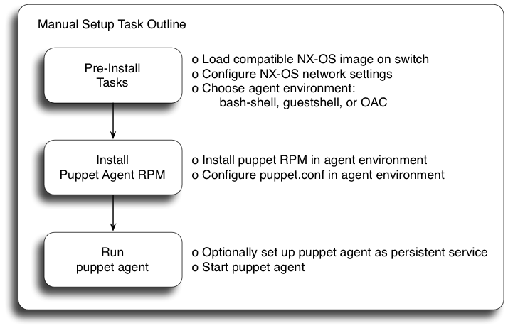

# Puppet Agent Installation & Setup: Cisco Nexus

#### Table of Contents

1. [Overview](#overview)
1. [Pre-Install Tasks](#pre-install)
1. [Puppet Agent Environment: bash-shell](#env-bs)
1. [Puppet Agent Environment: guestshell](#env-gs)
1. [Puppet Agent Environment: open agent container (OAC)](#env-oac)
1. [Puppet Agent Installation, Configuration and Usage](#agent-config)
1. [Optional: Guestshell & High Availability (HA) Platforms](#ha)
1. [Optional: Puppet Agent Persistence](#persistence)
1. [Optional: Automated Installation Options](#auto-install)
1. [References](#references)

## <a name="overview">Overview</a>

This document describes Puppet agent installation and setup on Cisco Nexus switches. These instructions focus on manual setup. See the [Automated Installation](#auto-install) section for documentation regarding alternative installation methods.



## <a name="pre-install">Pre-Install Tasks</a>

#### Platform and Software Minimum Requirements

* The Cisco NX-OS Puppet implementation requires open source Puppet version 4.0 or Puppet Enterprise 2015.2
* The Cisco IOS XR Puppet implementation requires open source Puppet version 4.3.2 or Puppet Enterprise 2015.3.2
* The following table lists supported platforms and OS versions.

Platform           | OS     | OS Version           |
-------------------|--------|----------------------|
Cisco Nexus N9k    | NX-OS  | 7.0(3)I2(1) and later
Cisco Nexus N3k    | NX-OS  | 7.0(3)I2(1) and later
Cisco Nexus N5k    | NX-OS  | 7.3(0)N1(1) and later
Cisco Nexus N6k    | NX-OS  | 7.3(0)N1(1) and later
Cisco Nexus N7k    | NX-OS  | 7.3(0)D1(1) and later

Please note: A virtual Nexus N9000/N3000 may be helpful for development and testing. Users with a valid [cisco.com](http://cisco.com) user ID can obtain a copy of a virtual Nexus N9000/N3000 by sending their [cisco.com](http://cisco.com) user ID in an email to <get-n9kv@cisco.com>. If you do not have a [cisco.com](http://cisco.com) user ID please register for one at [https://tools.cisco.com/IDREG/guestRegistration](https://tools.cisco.com/IDREG/guestRegistration)

#### Disk space

400MB of free disk space on bootflash is recommended before installing the
Puppet agent software.

#### Environment

NX-OS supports three possible environments for running third party software:
`bash-shell`, `guestshell` and the `open agent container (OAC)`.

Environment                  | Supported Platforms                      |
-----------------------------|------------------------------------------|
`bash-shell`                 | Cisco Nexus N3k, N9k                     |
`guestshell`                 | Cisco Nexus N3k, N9k                     |
`open agent container (OAC)` | Cisco Nexus N5k, N6k, N7k                |

You may run Puppet from either `bash-shell` or `guestshell` on supported platforms but not from both at the same time.

* `bash-shell`
  * This is the native WRL Linux environment underlying NX-OS. It is disabled by default on NX-OS.
* `guestshell`
  * This is a secure Linux container environment running CentOS. It is enabled by default in most platforms that support it.
* `open agent container`
  * This is a 32-bit CentOS-based container created specifically for running Puppet Agent software.
  * OAC containers are created for specific platforms and must be downloaded from Cisco.
  * The OAC must be installed before the Puppet Agent can be installed.

#### Set Up the Network

Ensure that you have network connectivity prior to Puppet installation. Some basic CLI configuration may be necessary.

**Example:** Connectivity via management interface - Nexus

_Note: The management interface exists in a separate VRF context and requires additional configuration as shown._

~~~
config term
  ntp server 10.0.0.201 use-vrf management

  vrf context management
    ip name-server 10.0.0.202
    ip domain-name mycompany.com
    ip route 0.0.0.0/0 10.0.0.1

  interface mgmt0
    vrf member management
    ip address 10.0.0.99/24
end
~~~

## <a name="env-bs">Puppet Agent Environment: bash-shell</a>

This section is only necessary if Puppet will run from the `bash-shell`.

### (NX-OS only) Enable the bash-shell

The `bash-shell` is disabled by default. Enable it with the feature configuration command.

~~~
config term
  feature bash-shell
end
~~~

### Set up the bash-shell environment

Enter the `bash-shell` environment and become root:

**Example:** Nexus

~~~bash
n3k# run bash
bash-4.2$
bash-4.2$  sudo su -
~~~

If you're using the management interface, you must next switch to the management namespace:

~~~bash
ip netns exec management bash
~~~

Regardless of OS, set up DNS configuration:

~~~
cat >> /etc/resolv.conf << EOF
nameserver 10.0.0.202
domain mycompany.com
EOF
~~~

*Please note: The current NX-OS bash-shell implementation does not automatically persist the entire linux filesystem. This means that certain files such as `/etc/resolv.conf` will not automatically be persistent after system reloads. Please execute `copy running-config startup-config` from the NX-OS cli after any changes to /etc/resolv.conf to ensure that it is persistent. This command can also be executed directly from the bash-shell using the vsh tool as shown:*

```
vsh -c 'copy running-config startup-config'
```

## <a name="env-gs">Puppet Agent Environment: guestshell</a>

This section is only necessary if Puppet will run from the `guestshell`.

#### Set Up NX-OS

The `guestshell` container environment is enabled by default on most platforms; however, the default disk and memory resources allocated to the guestshell container might be too small to support Puppet agent requirements. These resource limits can be increased with the NX-OS CLI `guestshell resize` commands as shown below.

The recommended minimum values are currently:

~~~bash
  Disk   : 400MB
  Memory : 300MB
~~~
  
Use the `show guestshell detail` command to display the current state of the guestshell:

~~~
n3k# show guestshell detail
Virtual service guestshell+ detail
  State                 : Activated
 ...
    Resource reservation
    Disk                : 150 MB
    Memory              : 128 MB

~~~

To resize the guestshell filesystem, use the `guestshell resize rootfs` command. To resize the guestshell memory allocation, use the `guestshell resize memory` command. These commands can be executed even when the guestshell is not yet enabled. Note that the resize command does not take effect until after the guestshell container is (re)started with the `guestshell reboot` or `guestshell enable` command.

**Example.** Guestshell is currently enabled. Resize guestshell filesystem to 400MB and memory to 300MB:

~~~
n3k# guestshell resize rootfs ?
  <158-600>  New root filesystem size (in MB)

n3k# guestshell resize rootfs 400
Note: Please disable/enable or reboot the Guest shell for root filesystem to be resized

n3k# guestshell resize memory 300
Note: Please disable/enable or reboot the Guest shell for system memory to be resized

n3k# guestshell reboot
Access to the guest shell will be temporarily disabled while it reboots.
Are you sure you want to reboot the guest shell? (y/n) [n] y
~~~

**Example.** Guestshell is currently disabled. Resize guestshell filesystem to 400MB and memory to 300MB:

~~~
n3k# guestshell resize rootfs 400
Note: Root filesystem will be resized on Guest shell enable

n3k# guestshell resize memory 300
Note: System memory will be resized on Guest shell enable

n3k# guestshell enable
~~~

See [References](#references) for more guestshell documentation.

#### Set Up Guestshell Network

The `guestshell` is an independent CentOS container that doesn't inherit settings from NX-OS; thus it requires additional network configuration.

~~~bash
# Enter the guestshell environment using the 'guestshell' command
guestshell

# If using the management interface, you must enter the management namespace
sudo su -
chvrf management

# Set up hostname and DNS configuration
hostname n3k

echo 'n3k' > /etc/hostname

cat >> /etc/resolv.conf << EOF
nameserver 10.0.0.202
domain mycompany.com
EOF
~~~

## <a name="env-oac">Puppet Agent Environment: open agent container (OAC)</a>

This section is only necessary if Puppet will run from the `open agent container`.

#### Set Up NX-OS

Download the `OAC` `oac.1.0.0.ova` file.

| Platform | OAC Download Link |
|----------|-------------------|
| Nexus N7k | [Download Link](https://software.cisco.com/download/release.html?i=!y&mdfid=283748960&softwareid=282088129&release=7.3%280%29D1%281%29&os=)|
| Nexus N5k and N6k | [Download Link](https://software.cisco.com/download/release.html?i=!y&mdfid=284360574&softwareid=282088130&release=7.3%280%29N1%281%29&os=)|

Copy the `ova` file to the `bootflash:` device.

~~~
n7k# dir bootflash: | inc oac.1.0.0.ova
   45424640    Feb 12 19:37:40 2016  oac.1.0.0.ova
~~~

Use the `show virtual-service global` command to display available resources for the `OAC` Virtual Service.

~~~
n7k# show virtual-service global 
...
Resource virtualization limits:
Name                        Quota    Committed    Available
-----------------------------------------------------------------------
system CPU (%)                  6            0            6
memory (MB)                  2304            0         2304
bootflash (MB)                600            0          600

n7k# 
~~~

The recommended minimum values are currently:

~~~bash
  memory    : 256MB
  bootflash : 400MB
~~~

**NOTE:** If insufficent `bootflash:` resources are available, remove unneeded files from `bootflash:` to free up space.

Install the `OAC` Virtual Service using the `virtual-service install` command:
`virtual-service install name oac package bootflash:oac.1.0.0.ova`

~~~
n7k# virtual-service install name oac package bootflash:oac.1.0.0.ova
Note: Installing package 'bootflash:/oac.1.0.0.ova' for virtual service 'oac'. Once the install has finished, the VM may be activated. Use 'show virtual-service list' for progress.

n7k# 2016 Feb 12 19:51:14 n7k %$ VDC-1 %$ %VMAN-2-INSTALL_STATE: Successfully installed virtual service 'oac'

n7k# show virtual-service list

Virtual Service List:

Name                    Status             Package Name
-----------------------------------------------------------------------
oac                     Installed          oac.1.0.0.ova

n7k# 
~~~

Activate the OAC using the `virtual-service` configuration command:

~~~
n7k# config t
Enter configuration commands, one per line.  End with CNTL/Z.
n7k(config)# virtual-service oac
n7k(config-virt-serv)# activate
Note: Activating virtual-service 'oac', this might take a few minutes. Use 'show virtual-service list' for progress.
n7k(config-virt-serv)# 
n7k(config-virt-serv)# end
n7k# 
n7k# 2016 Feb 12 19:55:06 n7k %$ VDC-1 %$ %VMAN-2-ACTIVATION_STATE: Successfully activated virtual service 'oac'
~~~

You may verify activation by using the `show virtual-service list` command:

~~~
n7k# show virtual-service list

Virtual Service List:

Name                    Status             Package Name
-----------------------------------------------------------------------
oac                     Activated          oac.1.0.0.ova

n7k# 
~~~

Open a console session to the `OAC` using the `virtual-service connect` command:

`virtual-service connect name oac console`

*note: The OAC's root password is initially set to `oac`. You are required to change it on initial login.*

~~~
n7k# virtual-service connect name oac console
Connecting to virtual-service.  Exit using ^c^c^c
Trying 127.1.1.5...
Connected to 127.1.1.5.
Escape character is '^]'.


CentOS release 6.7 (Final)
Kernel 2.6.99.99 on an x86_64

localhost login: root
Password: 
You are required to change your password immediately (root enforced)
Changing password for root.
(current) UNIX password: 
New password: 
Retype new password: 
[root@localhost ~]# 
~~~

See [References](#references) for more OAC documentation.

#### Set Up OAC Network

The `open agent container` is an independent CentOS container that doesn't inherit settings from NX-OS; thus it requires additional network configuration.  This configuration will be applied inside the `OAC` container.

Connect to the OAC console, then:

~~~bash

# First become root:
sudo su -

# Enter the management namespace if your device uses the management interface for connectivity.
chvrf management

# Set up hostname and DNS configuration
hostname n7k

echo 'n7k' > /etc/hostname

cat >> /etc/resolv.conf << EOF
nameserver 10.0.0.202
domain mycompany.com
EOF
~~~

## <a name="agent-config">Puppet Agent Installation, Configuration, and Usage</a>

This section is common to `bash-shell`, `guestshell` and the `open agent container`.

#### Install Puppet Agent

If needed, configure a proxy server to gain network access to `yum.puppetlabs.com`:

~~~bash
export http_proxy=http://proxy.yourdomain.com:<port>
export https_proxy=https://proxy.yourdomain.com:<port>
~~~

Import the Puppet GPG keys.

~~~
rpm --import http://yum.puppetlabs.com/RPM-GPG-KEY-puppetlabs
rpm --import http://yum.puppetlabs.com/RPM-GPG-KEY-reductive
~~~

The recommended Puppet RPM varies by environment:
* NX-OS:
  * `bash-shell`: Use [http://yum.puppetlabs.com/puppetlabs-release-pc1-cisco-wrlinux-5.noarch.rpm](http://yum.puppetlabs.com/puppetlabs-release-pc1-cisco-wrlinux-5.noarch.rpm)
  * `guestshell`: Due to issue https://tickets.puppetlabs.com/browse/FACT-1409, please install a `1.3.x` version of the puppet agent RPM inside the `guestshell`.
    * Latest `1.3.x` version at the time of publishing this module:
      * [http://yum.puppetlabs.com/el/7/PC1/x86_64/puppet-agent-1.3.6-1.el7.x86_64.rpm](http://yum.puppetlabs.com/el/7/PC1/x86_64/puppet-agent-1.3.6-1.el7.x86_64.rpm)
    * Once this issue is resolved use [http://yum.puppetlabs.com/puppetlabs-release-pc1-el-7.noarch.rpm](http://yum.puppetlabs.com/puppetlabs-release-pc1-el-7.noarch.rpm)
  * `open agent container (OAC)`: Use [http://yum.puppetlabs.com/puppetlabs-release-pc1-el-6.noarch.rpm](http://yum.puppetlabs.com/puppetlabs-release-pc1-el-6.noarch.rpm)

Using the appropriate RPM for your environment as described above, do:

~~~bash
yum install $PUPPET_RPM
yum install puppet
~~~

Update PATH var:

~~~bash
export PATH=/opt/puppetlabs/puppet/bin:/opt/puppetlabs/puppet/lib:$PATH
~~~

#### Install the cisco_node_utils gem

If you wish to make use of the types and providers in this module, you will need to install (and perhaps configure) the [`cisco_node_utils`](https://rubygems.org/gems/cisco_node_utils) Ruby gem. Refer to [README-gem-install.md](README-gem-install.md) for detailed steps.

#### Edit the Puppet config file:

**/etc/puppetlabs/puppet/puppet.conf**

This file can be used to override the default Puppet settings. At a minimum, the following settings should be used:

~~~bash
[main]
  server = mypuppetmaster.mycompany.com

[agent]
  pluginsync  = true
  ignorecache = true
~~~

See the following references for more puppet.conf settings:

* https://docs.puppetlabs.com/puppet/latest/reference/config_important_settings.html
* https://docs.puppetlabs.com/puppet/latest/reference/config_about_settings.html
* https://docs.puppetlabs.com/puppet/latest/reference/config_file_main.html
* https://docs.puppetlabs.com/references/latest/configuration.html

#### Run the Puppet Agent

~~~bash
puppet agent -t
~~~

## <a name="ha">Guestshell & High Availability (HA) Platforms</a>

Optional. This section discusses `guestshell` usage on HA platforms. This section does not apply to the bash-shell environment, open agent container (OAC) environment or to single-sup platforms.

The `guestshell` container does not automatically sync filesystem changes from the active processor to the standby processor. This means that Puppet installation files and related file changes performed in the earlier steps will not be present on the standby until they are manually synced with the following NX-OS exec command:

~~~
guestshell sync
~~~

## <a name="persistence">Puppet Agent Persistence</a>

Optional. This section discusses Puppet agent persistence after system restarts.

1. [Service Management in bash-shell using init.d](#svc-mgmt-bs)
2. [Service Management in guestshell using systemd](#svc-mgmt-gs)
3. Not supported for the open agent container (OAC)

#### Service Management

It may be desirable to set up automatic restart of the Puppet agent in the event of a system reset. The bash and guestshell environments use different methods to achieve this.

#### <a name="svc-mgmt-bs">Optional: bash-shell / init.d</a>

The `bash-shell` environment uses **init.d** for service management.
The Puppet agent provides a generic init.d script when installed, but a slight
modification is needed to ensure that Puppet runs in the correct namespace:

**Nexus**
~~~diff
--- /etc/init.d/puppet.old
+++ /etc/init.d/puppet
@@ -38,7 +38,7 @@
 
 start() {
     echo -n $"Starting puppet agent: "
-    daemon $daemonopts $puppetd ${PUPPET_OPTS} ${PUPPET_EXTRA_OPTS}
+    daemon $daemonopts ip netns exec management $puppetd ${PUPPET_OPTS} ${PUPPET_EXTRA_OPTS}
     RETVAL=$?
     echo
         [ $RETVAL = 0 ] && touch ${lockfile}
~~~

Next, in any case, enable the puppet service to be automatically started at boot time, and optionally start it now:

~~~bash
chkconfig --add puppet
chkconfig --level 345 puppet on

service puppet start
~~~

#### <a name="svc-mgmt-gs">Optional: guestshell / systemd</a>

The `guestshell` environment uses **systemd** for service management.
The Puppet agent provides a generic systemd script when installed, but a slight modification
is needed to ensure that Puppet runs in the management namespace:

~~~diff
--- /usr/lib/systemd/system/puppet.service.old
+++ /usr/lib/systemd/system/puppet.service
@@ -7,7 +7,7 @@
 EnvironmentFile=-/etc/sysconfig/puppetagent
 EnvironmentFile=-/etc/sysconfig/puppet
 EnvironmentFile=-/etc/default/puppet
-ExecStart=/opt/puppetlabs/puppet/bin/puppet agent $PUPPET_EXTRA_OPTS --no-daemonize
+ExecStart=/bin/nsenter --net=/var/run/netns/management /opt/puppetlabs/puppet/bin/puppet agent $PUPPET_EXTRA_OPTS --no-daemonize
 KillMode=process
 
 [Install]
~~~

Now enable your Puppet systemd service (the `enable` command adds it to systemd for autostarting the next time you boot) and optionally start it.

~~~bash

systemctl enable my_puppet
systemctl start my_puppet

~~~

## <a name="auto-install">Automated Installation Options</a>

[Beaker](README-beaker-agent-install.md) - Installing and Configuring Puppet Agent Using the Beaker Tool

## <a name="references">References</a>

[Cisco Nexus Puppet Modules](../README.md) - Types, Providers, Utilities

[Cisco Nexus 9000 Programmability Guide](http://www.cisco.com/c/en/us/td/docs/switches/datacenter/nexus9000/sw/6-x/programmability/guide/b_Cisco_Nexus_9000_Series_NX-OS_Programmability_Guide/b_Cisco_Nexus_9000_Series_NX-OS_Programmability_Guide_chapter_01010.html) - Guestshell Documentation

[Cisco Nexus 5000 and 6000 Programmability Guide](http://www.cisco.com/c/en/us/td/docs/switches/datacenter/nexus5000/sw/programmability/guide/b_Cisco_Nexus_5K6K_Series_NX-OS_Programmability_Guide/b_Cisco_Nexus_5K6K_Series_NX-OS_Programmability_Guide_chapter_01001.html) - Open Agent Container Documentation

[Cisco Nexus 7000 Programmability Guide](http://www.cisco.com/c/en/us/td/docs/switches/datacenter/nexus7000/sw/programmability/guide/b_Cisco_Nexus_7000_Series_NX-OS_Programmability_Guide/b_Cisco_Nexus_7000_Series_NX-OS_Programmability_Guide_chapter_01001.html) - Open Agent Container Documentation

----
~~~
Copyright (c) 2014-2016 Cisco and/or its affiliates.

Licensed under the Apache License, Version 2.0 (the "License");
you may not use this file except in compliance with the License.
You may obtain a copy of the License at

    http://www.apache.org/licenses/LICENSE-2.0

Unless required by applicable law or agreed to in writing, software
distributed under the License is distributed on an "AS IS" BASIS,
WITHOUT WARRANTIES OR CONDITIONS OF ANY KIND, either express or implied.
See the License for the specific language governing permissions and
limitations under the License.
~~~
