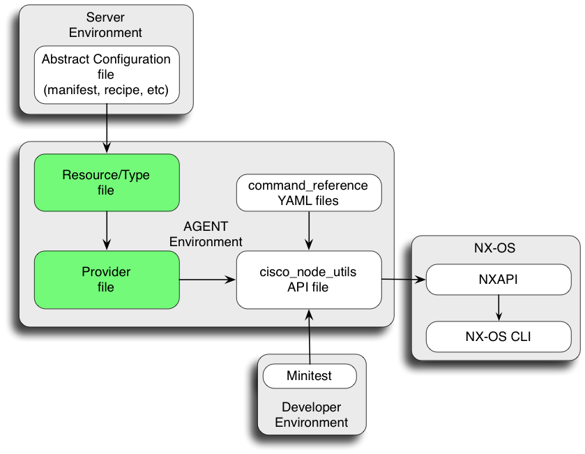

# Developing Cisco NX-OS Types and Providers

#### Table of Contents

* [Overview](#overview)
* [Start here: Clone the Repo](#clone)
* [Basic Example: feature bash-shell](#simp_example)
   * [Step 1. Type: feature bash-shell](#simp_type)
   * [Step 2. Provider: feature bash-shell](#simp_prov)
   * [Step 3. Testing: feature bash-shell](#simp_test)
   * [Static Analysis](#simp_sa)
* [Complex Example: router eigrp](#comp_example)
   * [Step 1. Type: router eigrp](#comp_type)
   * [Step 2. Provider: router eigrp](#comp_prov)
   * [Step 3. Testing: router eigrp](#comp_test)
   * [Static Analysis](#comp_sa)
* [Next Steps](#next)

## <a name="overview">Overview</a>

This document is a guide for writing new Puppet resource types and providers for Cisco NX-OS.

There are multiple components involved when creating new resources. This document focuses on the type and provider files:

* Every resource is associated with a [resource type](https://docs.puppetlabs.com/puppet/latest/reference/lang_resources.html), which determines the kind of configuration it manages.

* [Resource providers](https://docs.puppetlabs.com/guides/provider_development.html) are essentially backends that implement support for a specific implementation of a given resource type.

* The types and providers work in conjunction with a node\_utils API, which is the interface between Puppet agent and the NX-OS CLI. Please see the [README-develop-node-utils-APIs.md] (https://github.com/cisco/cisco-network-node-utils/blob/master/README-develop-node-utils-APIs.md) guide for more information on writing node_utils APIs.

This document relies heavily on example code. The examples in this document can be written independently, but they are intended to work in conjuction with the example node_utils APIs created in the [README-develop-node_utils-APIs.md](https://github.com/cisco/cisco-network-node-utils/blob/master/README-develop-node-utils-APIs.md) guide. The examples in that guide are based on code templates for the `feature bash-shell` CLI and the `router eigrp` CLI. Note that some people prefer to write the node_utils API before the resource types and providers, while others might prefer the opposite workflow.

## <a name="clone">Start here: Clone the Repo</a>

Please see the [CONTRIBUTING](#CONTRIBUTING) document for workflow instructions. In general, fork the ciscopuppet repository for your changes and submit a pull request when it is ready for commit.

First install the code base. Clone the ciscopuppet repo into a workspace:

~~~bash
git clone https://github.com/cisco/cisco-network-puppet-module.git
~~~

## <a name="simp_example">Basic Example: feature bash-shell</a>

The NX-OS CLI for `feature bash-shell` is a simple on / off style configuration:

`[no] feature bash-shell`

This resource has no other properties.

*Note. This example disables the bash-shell, so use the guestshell environment when testing.*

## <a name="simp_type">Step 1. Type: feature bash-shell</a>

* There are template files in `/docs` that might help when you write new types and providers. These templates provide most of the necessary code with a few customizations required for a new resource. Copy the `template-type-feature.rb` file to use as the basis for our new `cisco_bash_shell.rb` type file:

~~~bash
cp  cisco-ciscopuppet/docs/template-type-feature.rb \
    cisco-ciscopuppet/lib/puppet/type/cisco_bash_shell.rb
~~~

* Edit `cisco_bash_shell.rb` and substitute the placeholder text as shown here:

~~~bash
/X__RESOURCE_NAME__X/bash_shell/
~~~

#### Example: cisco_bash_shell.rb type file

This is the completed bash_shell resource type based on `template-type-feature.rb`:

~~~puppet
#
# Puppet resource type for feature bash_shell
#
# Copyright (c) 2014-2015 Cisco and/or its affiliates.
#
# Licensed under the Apache License, Version 2.0 (the "License");
# you may not use this file except in compliance with the License.
# You may obtain a copy of the License at
#
#     http://www.apache.org/licenses/LICENSE-2.0
#
# Unless required by applicable law or agreed to in writing, software
# distributed under the License is distributed on an "AS IS" BASIS,
# WITHOUT WARRANTIES OR CONDITIONS OF ANY KIND, either express or implied.
# See the License for the specific language governing permissions and
# limitations under the License.

Puppet::Type.newtype(:bash_shell) do

  @doc = "Manages configuration of feature bash-shell

    ~~~
  cisco_bash_shell {'<title>':
    ..attributes..
  }
    ~~~

  Example:

     ~~~
    cisco_bash_shell {'xxxxx' :
      ensure => present,
    }
     ~~~
  "

  ensurable

  newparam(:name, :namevar => true) do
    desc "Resource title. Valid values are string."
  end

  # There are no additional properties for this command.
end
~~~

## <a name="simp_prov">Step 2. Provider: feature bash-shell</a>

* The provider files for Cisco NX-OS are named nxapi.rb and are each stored in a unique provider directory. Create a new directory for the bash_shell provider and use `template-provider-feature.rb` to populate the new provider file:

~~~bash
mkdir  cisco-ciscopuppet/lib/puppet/provider/cisco_bash_shell

cp  cisco-ciscopuppet/docs/template-provider-feature.rb \
       cisco-ciscopuppet/lib/puppet/provider/cisco_bash_shell/nxapi.rb
~~~

* Edit `nxapi.rb` and substitute the placeholder text as shown here:

~~~bash
/X__RESOURCE_NAME__X/bash_shell/

/X__CLASS_NAME__X/BashShell/
~~~

#### Example: cisco_bash_shell.rb provider file

This is the completed bash_shell provider based on `template-provider-feature.rb`:

~~~puppet
:Type.type(:cisco_bash_shell).provide(:nxapi) do

  confine :feature => :cisco_node_utils

  mk_resource_methods

  def initialize(value={})
    super(value)
    @property_flush = {}
  end

  def self.instances
    inst = []
    return inst unless Cisco::BashShell.feature_enabled
    current_state = { :name => 'default', :ensure => :present}
    inst << new(current_state)
    return inst
  end

  def self.prefetch(resources)
    provider = instances
    resources.values.first.provider = provider.first unless provider.first.nil?
  end

  def exists?
    @property_hash[:ensure] == :present
  end

  def create
    @property_flush[:ensure] = :present
  end

  def destroy
    @property_flush[:ensure] = :absent
  end

  def flush
    case @property_flush[:ensure]
    when :present
      Cisco::BashShell.new.feature_enable
    when :absent
      Cisco::BashShell.new.feature_disable
    end
  end

end
~~~

## <a name="simp_test">Step 3. Testing: feature bash-shell</a>

Test the new resource using the guestshell environment. See [README-agent-install.md](README-agent-install.md) for using Puppet agent in guestshell.

* Create a manifest for the new resource:

~~~puppet
cisco_bash_shell { 'bash_on' :
  ensure => present,
}
~~~

* Manually check that the state of the resource is disabled on the switch. In this case the NX-OS CLI config is not present when feature bash-shell is disabled.

~~~
n3k# sh run | i 'feature bash'
n3k#
~~~

* Run the Puppet agent:

*Note. The --trace option is helpful when troubleshooting agent failures*

~~~
[root@guestshell guestshell]# puppet agent -t --trace
Info: Retrieving pluginfacts
Info: Retrieving plugin
Info: Loading facts
Info: Caching catalog for n3k.cisco.com
Info: Applying configuration version '1438270388'
Notice: /Stage[main]/Main/Node[n3k]/Cisco_bash_shell[bash_on]/ensure: created
Notice: Applied catalog in 0.26 seconds
~~~

* Check state on the switch again:

~~~
n3k# sh run | i 'feature bash'
feature bash-shell
~~~

* We now have the expected state. Next, test the Puppet resource command while the feature is still enabled:

~~~
[root@guestshell guestshell]# puppet resource cisco_bash_shell
cisco_bash_shell { 'default':
  ensure => 'present',
}
~~~
*Note. This test manifest should be added to examples/demo_install.rb*

* Change the manifest to ensure => absent to disable the state, then repeat the tests:

~~~puppet
cisco_bash_shell { 'bash_off' :
  ensure => absent,
}
~~~

~~~
n3k# sh run | i 'feature bash'
feature bash-shell
~~~
~~~
[root@guestshell guestshell]# puppet agent -t
Info: Retrieving pluginfacts
Info: Retrieving plugin
Info: Loading facts
Info: Caching catalog for n3k.cisco.com
Info: Applying configuration version '1438270530'
Notice: /Stage[main]/Main/Node[n3k]/Cisco_bash_shell[bash_off]/ensure: removed
Notice: Applied catalog in 0.35 seconds
~~~
~~~
n3k# sh run | i 'feature bash'
n3k#
~~~
~~~
[root@guestshell guestshell]# puppet resource cisco_bash_shell

 (a blank response is correct here)
~~~

* `puppet resource` can also be used for testing changes to provider states. This method is often easier and doesn't require a manifest:

~~~puppet
puppet resource cisco_bash_shell 'test_on' ensure=present

puppet resource cisco_bash_shell 'test_off' ensure=absent
~~~

## <a name="simp_sa">Static Analysis</a>

* rubocop is a Ruby static analysis tool. Run [rubocop](https://rubygems.org/gems/rubocop) to validate the new code:

~~~bash
% rubocop type/cisco_bash_feature.rb  provider/cisco_bash_feature/nxapi.rb
Inspecting 2 files
..

2 files inspected, no offenses detected
~~~

## <a name="comp_example">Complex Example: router eigrp</a>

This resource type and provider exercise will build on the router_eigrp API example shown in the cisco node_utils [README-develop-node-utils-APIs](https://github.com/cisco/cisco-network-node-utils/blob/master/README-develop-node-utils-APIs.md) document.
The router_eigrp node_utils example created a new API for the cli below:

~~~
[no] feature eigrp
[no] router eigrp [name]    (string)
       maximum-paths [n]    (integer)
  [no] shutdown             (boolean)
~~~

This example needs to support:

* multiple router eigrp instances, identified by 'name'
* an integer property
* a boolean property

Router eigrp also supports `vrf` and `address-family` sub-modes, which further complicate the configuration but are not included in this exercise.

The Puppet type and provider code doesn't need any knowledge of `feature eigrp` because that configuration is controlled automatically by the router_eigrp node_utils API; therefore, we need to implement only the router commands themselves.

## <a name="comp_type">Step 1. Type: router eigrp</a>

* Copy the `template-type-router.rb` file to use as the basis for the `cisco_router_eigrp.rb` type file:

~~~bash
cp  cisco-ciscopuppet/docs/template-type-router.rb \
    cisco-ciscopuppet/lib/puppet/type/cisco_router_eigrp.rb
~~~

* Edit `cisco_router_eigrp.rb` and substitute the placeholder text as shown here:

~~~bash
/X__CLASS_NAME__X/RouterEigrp/

/X__RESOURCE_NAME__X/router_eigrp/

/X__PROPERTY_INT__X/maximum_paths/

/X__PROPERTY_BOOL__X/shutdown/
~~~

There might be additional steps to follow in the template.

#### Example: cisco_router_eigrp.rb type file

This is the completed router_eigrp type based on `template-type-router.rb`:

~~~puppet
#
# Puppet resource type for router_eigrp
#
# Copyright (c) 2014-2015 Cisco and/or its affiliates.
#
# Licensed under the Apache License, Version 2.0 (the "License");
# you may not use this file except in compliance with the License.
# You may obtain a copy of the License at
#
#     http://www.apache.org/licenses/LICENSE-2.0
#
# Unless required by applicable law or agreed to in writing, software
# distributed under the License is distributed on an "AS IS" BASIS,
# WITHOUT WARRANTIES OR CONDITIONS OF ANY KIND, either express or implied.
# See the License for the specific language governing permissions and
# limitations under the License.

Puppet::Type.newtype(:cisco_router_eigrp) do

  @doc = "Manages configuration of a router_eigrp instance

    ~~~
  cisco_router_eigrp {'<string>':
    ..attributes..
  }
    ~~~

  `<string>` is the name of the router_eigrp instance.

  Example:

    ~~~
    cisco_router_eigrp { 'green' :
      ensure        => present,
      maximum_paths => 5,
      shutdown      => true,
    }
    ~~~
  "

  ensurable

  ###################
  # Resource Naming #
  ###################

  # Parse the title to populate the attributes in these patterns.
  # These attributes might be overwritten later.
  def self.title_patterns
    identity = lambda { |x| x }
    patterns = []

    # Below pattern matches the resource name.
    patterns << [
      /^(\S+)$/,
      [
        [:name, identity]
      ]
    ]
    return patterns
  end

  newparam(:name, :namevar => true) do
    desc "Name of the router_eigrp instance. Valid values are string."
  end

  newproperty(:maximum_paths) do
    desc "Sets the number of equal cost paths that EIGRP accepts in the route table.
          Valid values are integer, keyword 'default'."

    munge { |value|
      value = :default if value == 'default'
      begin
        value = Integer(value) unless value == :default
      rescue
        fail "maximum_paths must be a valid integer, or default."
      end
      value
    }
  end

  newproperty(:shutdown) do
    desc "shutdown state of the interface."

    newvalues(:true, :false, :default)
  end

end
~~~

## <a name="comp_prov">Step 2. Provider: router eigrp</a>

* Create a new directory for the router_eigrp provider and use `template-provider-router.rb` to populate the new provider file:

~~~bash
mkdir  cisco-ciscopuppet/lib/puppet/provider/cisco_router_eigrp

cp  cisco-ciscopuppet/docs/template-provider-router.rb \
       cisco-ciscopuppet/lib/puppet/provider/cisco_router_eigrp/nxapi.rb
~~~

* Edit `nxapi.rb` and substitute the placeholder text as shown here:

~~~bash
/X__CLASS_NAME__X/RouterEigrp/

/X__RESOURCE_NAME__X/router_eigrp/

/X__CONSTANT_NAME__X/ROUTER_EIGRP/

/X__PROPERTY_INT__X/maximum_paths/

/X__PROPERTY_BOOL__X/shutdown/
~~~

There might be additional steps to follow in the template.

#### Example: cisco_router_eigrp.rb provider file

~~~puppet
#
# The NXAPI provider for cisco_router_eigrp.
#
# Copyright (c) 2015 Cisco and/or its affiliates.
#
# Licensed under the Apache License, Version 2.0 (the "License");
# you may not use this file except in compliance with the License.
# You may obtain a copy of the License at
#
#     http://www.apache.org/licenses/LICENSE-2.0
#
# Unless required by applicable law or agreed to in writing, software
# distributed under the License is distributed on an "AS IS" BASIS,
# WITHOUT WARRANTIES OR CONDITIONS OF ANY KIND, either express or implied.
# See the License for the specific language governing permissions and
# limitations under the License.

require 'cisco_node_utils' if Puppet.features.cisco_node_utils?
begin
  require 'puppet_x/cisco/autogen'
rescue LoadError # seen on master, not on agent
  # See longstanding Puppet issues #4248, #7316, #14073, #14149, etc. Ugh.
  require File.expand_path(File.join(File.dirname(__FILE__), '..', '..', '..',
                                     'puppet_x', 'cisco', 'autogen.rb'))
end

Puppet::Type.type(:cisco_router_eigrp).provide(:nxapi) do
  desc "The NXAPI provider for cisco_router_eigrp."

  confine :feature => :cisco_node_utils

  mk_resource_methods

  # Property symbol arrays for method auto-generation. There are separate arrays
  # because the boolean-based methods are processed slightly different.
  ROUTER_EIGRP_NON_BOOL_PROPS = [
    :maximum_paths,
  ]
  ROUTER_EIGRP_BOOL_PROPS = [
    :shutdown,
  ]
  ROUTER_EIGRP_ALL_PROPS =
    ROUTER_EIGRP_NON_BOOL_PROPS + ROUTER_EIGRP_BOOL_PROPS

  # Dynamic method generation for getters & setters
  PuppetX::Cisco::AutoGen.mk_puppet_methods(:non_bool, self, "@router_eigrp",
                                            ROUTER_EIGRP_NON_BOOL_PROPS)
  PuppetX::Cisco::AutoGen.mk_puppet_methods(:bool, self, "@router_eigrp",
                                            ROUTER_EIGRP_BOOL_PROPS)

  def initialize(value={})
    super(value)
    @router_eigrp = Cisco::RouterEigrp.routers[@property_hash[:name]]
    @property_flush = {}
  end

  def self.get_properties(instance_name, inst)
    debug "Checking instance, #{instance_name}."
    current_state = {
      :name => instance_name,
      :ensure => :present,
    }
    # Call node_utils getter for each property
    ROUTER_EIGRP_NON_BOOL_PROPS.each { |prop|
      current_state[prop] = inst.send(prop)
    }
    ROUTER_EIGRP_BOOL_PROPS.each { |prop|
      val = inst.send(prop)
      current_state[prop] = val.nil? ? nil : (val ? :true : :false)
    }
    new(current_state)
  end # self.get_properties

  def self.instances
    instance_array = []
    Cisco::RouterEigrp.routers.each { | instance_name, inst |
      begin
        instance_array << get_properties(instance_name, inst)
      end
    }
    return instance_array
  end # self.instances

  def self.prefetch(resources)
    instance_array = instances
    resources.keys.each do |name|
      provider = instance_array.find { |inst| inst.name == name }
      resources[name].provider = provider unless provider.nil?
    end
  end # self.prefetch

  def exists?
    return (@property_hash[:ensure] == :present)
  end

  def create
    @property_flush[:ensure] = :present
  end

  def destroy
    @property_flush[:ensure] = :absent
  end

  def set_properties(new_instance=false)
    ROUTER_EIGRP_ALL_PROPS.each { |prop|
      if @resource[prop]
        if new_instance
          # Call puppet setter to set @property_flush[prop]
          self.send("#{prop}=", @resource[prop])
        end
        unless @property_flush[prop].nil?
          # Call node_utils setter to update node
          @router_eigrp.send("#{prop}=", @property_flush[prop]) if
            @router_eigrp.respond_to?("#{prop}=")
        end
      end
    }
  end

  def flush
    if @property_flush[:ensure] == :absent
      @router_eigrp.destroy
      @router_eigrp = nil
    else
      # Create/Update
      if @router_eigrp.nil?
        new_instance = true
        @router_eigrp = Cisco::RouterEigrp.new(@resource[:name])
      end
      set_properties(new_instance)
    end
  end

end
~~~

## <a name="comp_test">Step 3. Testing: router eigrp</a>

* Create a manifest for the new resource:

~~~puppet
cisco_router_eigrp { 'test' :
  ensure => present,
  maximum_paths => 5,
  shutdown => true,
}
~~~

* Manually check that the state of the resource is disabled on the switch.

~~~
n3k# sh run eigrp
                          ^
% Invalid command at '^' marker.

 (feature eigrp is disabled so this error is expected)
~~~

* Run the Puppet agent:

*Note. The --trace option is helpful when troubleshooting agent failures*

~~~
[root@guestshell guestshell]# puppet agent -t
[root@guestshell guestshell]# puppet agent -t
Info: Retrieving pluginfacts
Info: Retrieving plugin
Info: Loading facts
Info: Caching catalog for n3k.cisco.com
Info: Applying configuration version '1438344401'
Notice: /Stage[main]/Main/Node[n3k]/Cisco_router_eigrp[test]/ensure: created
Notice: Applied catalog in 4.65 seconds
~~~

* Check state on the switch again:

~~~
n3k# sh run eigrp
feature eigrp

router eigrp test
  maximum-paths 5
  shutdown
~~~

* Run Puppet agent again to test for idempotency. You should NOT see `Cisco_router_eigrp[test]/ensure: created` in the log, indicating that the state has not changed:

~~~
[root@guestshell guestshell]# puppet agent -t
Info: Retrieving pluginfacts
Info: Retrieving plugin
Info: Loading facts
Info: Caching catalog for n3k.cisco.com
Info: Applying configuration version '1438344623'
Notice: Applied catalog in 0.16 seconds
~~~

* Test the `puppet resource` command while the feature is enabled:

~~~
[root@guestshell guestshell]# puppet resource cisco_router_eigrp
cisco_router_eigrp { 'test':
  ensure        => 'present',
  maximum_paths => '5',
  shutdown      => 'true',
}

~~~
*Note. This test manifest should be added to examples/demo_install.rb*

* Alternative tests with `puppet resource`:

~~~puppet
puppet resource cisco_router_eigrp "xyz" ensure=present shutdown=true maximum_paths=3

puppet resource cisco_router_eigrp "xyz" shutdown='default'

puppet resource cisco_router_eigrp "xyz" ensure=absent
~~~

## <a name="comp_sa">Static Analysis</a>

* Run [rubocop](https://rubygems.org/gems/rubocop) to validate the new code:

~~~bash
% rubocop type/cisco_router_eigrp.rb provider/cisco_router_eigrp/nxapi.rb
Inspecting 2 files
..

2 files inspected, no offenses detected
~~~

## <a name="next">Next Steps</a>

Please see the [CONTRIBUTING](#CONTRIBUTING) document for workflow instructions.
